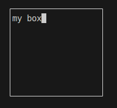
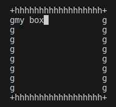
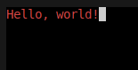
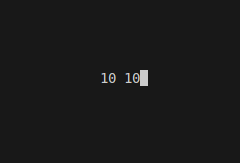
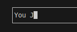

# ncurses

**ncurses** («new [curses](https://ru.wikipedia.org/wiki/Curses "Curses")») — библиотека, написанная на языках [Си](https://ru.wikipedia.org/wiki/%D0%A1%D0%B8_(%D1%8F%D0%B7%D1%8B%D0%BA_%D0%BF%D1%80%D0%BE%D0%B3%D1%80%D0%B0%D0%BC%D0%BC%D0%B8%D1%80%D0%BE%D0%B2%D0%B0%D0%BD%D0%B8%D1%8F) "Си (язык программирования)") и [Ада](https://ru.wikipedia.org/wiki/%D0%90%D0%B4%D0%B0_(%D1%8F%D0%B7%D1%8B%D0%BA_%D0%BF%D1%80%D0%BE%D0%B3%D1%80%D0%B0%D0%BC%D0%BC%D0%B8%D1%80%D0%BE%D0%B2%D0%B0%D0%BD%D0%B8%D1%8F) "Ада (язык программирования)"), предназначенная для управления [вводом-выводом](https://ru.wikipedia.org/wiki/%D0%92%D0%B2%D0%BE%D0%B4-%D0%B2%D1%8B%D0%B2%D0%BE%D0%B4 "Ввод-вывод") на [терминал](https://ru.wikipedia.org/wiki/%D0%9A%D0%BE%D0%BC%D0%BF%D1%8C%D1%8E%D1%82%D0%B5%D1%80%D0%BD%D1%8B%D0%B9_%D1%82%D0%B5%D1%80%D0%BC%D0%B8%D0%BD%D0%B0%D0%BB "Компьютерный терминал"), в числе прочего, библиотека позволяет задавать экранные координаты (в знакоместах) и цвет выводимых символов.

[Ncurses Tutorial 2 - YouTube](https://www.youtube.com/watch?v=pjT5wq11ZSE&list=PL2U2TQ__OrQ8jTf0_noNKtHMuYlyxQl4v&index=3)

# Первый пример

```c
#include <stdio.h>
#include <ncurses.h>

int main()
{
    initscr(); // инициирует и очищает экран и память

    int x, y;
    x = y = 10;
    move(y, x); // перемещает курсоп

    printw("Hello"); // печать в окно
    refresh();       // перерисовыет экран согласно памяти

    int c = getch(); // ждёт ввода пользователя
    clear();         // очистить экран
    move(0, 0);
    // mvprintw(0,0,"%d", c); // переместить и напечатать
    printw("%d", c);

    getch();
    endwin(); // очищает память и завершает ncurses

    return 0;
}
```

```makefile
all:
    gcc s21_brick_game.c -lncurses
```

# Пример с окном



```c
#include <stdio.h>
#include <ncurses.h>

int main()
{
    initscr(); // инициирует и очищает экран и память
    int height, width, start_y, start_x;
    height = 10;
    width = 20;
    start_y = start_x = 10;

    // окно
    WINDOW *win = newwin(height, width, start_y, start_x);
    refresh(); // обновить

    box(win, 0, 0); // рамка
    // wprintw(win, "my box");// печатать в окно
    mvwprintw(win, 1, 1, "my box"); // печатать в окно с перемещением
    wrefresh(win);                  // обновить только

    int c = getch(); // ждёт ввода пользователя
    endwin();        // очищает память и завершает ncurses

    return 0;
}
```

# Настройка отображения окона и режим взятия символов



1. **`cbreak()`**: Эта функция переводит терминал в неканонический режим, что позволяет программе читать ввод данных немедленно после нажатия клавиши, без необходимости нажимать Enter. В каноническом режиме (по умолчанию) ввод данных происходит только после нажатия Enter, и данные не передаются в программу до этого момента.

2. **`raw()`**: Функция `raw()` делает то же самое, что и `cbreak()`, но также отключает обработку специальных символов, таких как Ctrl+C и Ctrl+Z, которые обычно используются для прерывания и приостановки программы соответственно. Это делает ввод данных еще более "сырым", поскольку программа получает каждый символ ввода непосредственно, без дополнительной обработки.

3. **`noecho()`**: Функция `noecho()` отключает отображение вводимых пользователем символов на экране. В обычном режиме, когда пользователь вводит текст, каждый символ отображается на экране. Отключение отображения может быть полезно в приложениях, где ввод данных должен оставаться приватным или когда отображение вводимых символов нежелательно.

```c
#include <stdio.h>
#include <ncurses.h>

int main()
{
    initscr(); // инициирует и очищает экран и память
    cbreak();  // режим без Enter (или для тестирования и выхода)
    // raw(); // режим без специальных комбинация клавиш
    noecho(); // не отображать данные

    int height, width, start_y, start_x;
    height = 10;
    width = 20;
    start_y = start_x = 10;

    // окно
    WINDOW *win = newwin(height, width, start_y, start_x);
    refresh(); // обновить

    char c = 'g';
    box(win, (int)c, 104); // рамка из символов

    // тонкая настройка окна
    int left, right, top, bottom, tlc, trc, bld, brc;
    char c_plus = '+';
    left = right = 103;
    top = bottom = 104;
    tlc = trc = bld = brc = c_plus;
    wborder(win, left, right, top, bottom, tlc, trc, bld, brc);

    mvwprintw(win, 1, 1, "my box"); // печатать в окно с перемещением
    wrefresh(win);                  // обновить только окно

    getch();
    endwin();        // очищает память и завершает ncurses
    return 0;
}
```

# Работа с цветом



1. **Цвета текста**:
   - `COLOR_BLACK`
   - `COLOR_RED`
   - `COLOR_GREEN`
   - `COLOR_YELLOW`
   - `COLOR_BLUE`
   - `COLOR_MAGENTA`
   - `COLOR_CYAN`
   - `COLOR_WHITE`

```c
#include <ncurses.h>

int main()
{
    initscr();     // Инициализация ncurses
    start_color(); // Инициализация цветовой подсистемы

    // Определение пары цветов
    init_pair(1, COLOR_RED, COLOR_BLACK);

    // Применение цвета
    attron(COLOR_PAIR(1));
    printw("Hello, world!");
    attroff(COLOR_PAIR(1));

    refresh(); // Обновление экрана
    getch();   // Ожидание нажатия клавиши

    endwin(); // Завершение работы с ncurses
    return 0;
}
```

# Информация о положении курсора и размерах окна



```c
#include <ncurses.h>

int main()
{
    initscr(); // Инициализация ncurses
    noecho();
    cbreak();

    int y, x, yBeg, xBeg, yMax, xMax;
    WINDOW *win = newwin(10, 20, 10, 10);
    getyx(stdscr, y, x);          // Получение текущего положения курсора
    getbegyx(win, yBeg, xBeg);    // Получение координат верхнего левого угла окна
    getmaxyx(stdscr, yMax, xMax); // Получение максимальных размеров окна
    mvprintw(yMax / 2, xMax / 2, "%d %d", yBeg, xBeg);

    refresh(); // Обновление экрана
    getch();   // Ожидание нажатия клавиши
    endwin();  // Завершение работы с ncurses
    return 0;
}
```

Все эти функции принимают в качестве первого аргумента указатель на окно, для которого нужно получить информацию. В примерах выше используется `stdscr`, что означает стандартное окно `ncurses`.

# Поле ввода

### Перехват клавиши `j`



```c
#include <ncurses.h>

int main()
{
    initscr(); // Инициализация ncurses
    noecho();
    cbreak();

    // get screen size
    int yMax, xMax;
    getmaxyx(stdscr, yMax, xMax);

    // create a window for our input
    WINDOW *inputwin = newwin(3, xMax - 12, yMax - 5, 10);
    box(inputwin, 0, 0);
    refresh(); // Обновление экрана
    wrefresh(inputwin);

    // поле ввода
    int c = wgetch(inputwin);
    if (c == 'j')
    {
        mvwprintw(inputwin, 1, 1, "You J");
        wrefresh(inputwin);
    }

    getch();  // Ожидание нажатия клавиши
    endwin(); // Завершение работы с ncurses
    return 0;
}
```

### Перехват стрелки `вверх`

```c
#include <ncurses.h>

int main()
{
    initscr(); // Инициализация ncurses
    noecho();
    cbreak();

    // get screen size
    int yMax, xMax;
    getmaxyx(stdscr, yMax, xMax);

    // create a window for our input
    WINDOW *inputwin = newwin(3, xMax - 12, yMax - 5, 10);
    box(inputwin, 0, 0);
    refresh(); // Обновление экрана
    wrefresh(inputwin);

    keypad(inputwin, true); // для нажатия стрелки

    // поле ввода
    int c = wgetch(inputwin);
    if (c == KEY_UP)
    {
        mvwprintw(inputwin, 1, 1, "You up");
        wrefresh(inputwin);
    }

    getch();  // Ожидание нажатия клавиши
    endwin(); // Завершение работы с ncurses
    return 0;
}
```
