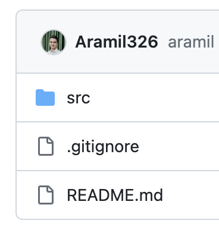
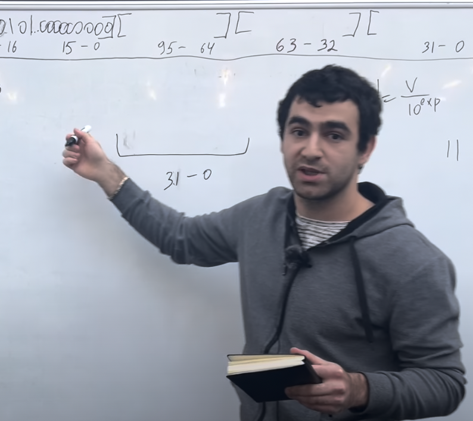
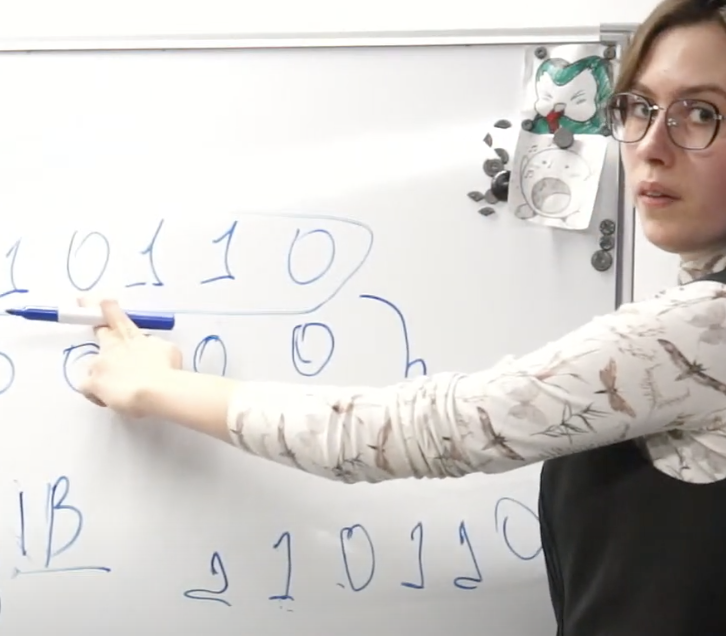

# s21_decimal

## s21_decimal (чей-то проект)  
<code>  
[s21_decimal](https://github.com/Aramil326/decimal/tree/master "Описание")
</code>

## s21_decimal (Лекция)  
<code>  
[s21_decimal](https://youtu.be/kJU4JOLa8l0?si=KHCALycsqBpZ1AAv "Описание")
</code>

## s21_decimal (Лекция)  
<code>  
[s21_decimal](https://www.youtube.com/live/94QJYpYuSU0?si=ZJ0Lv22Matkfhmgx "Описание")
</code>