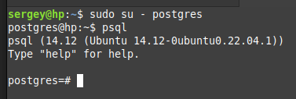

# Установка PostgreSQL

**PostgreSQL** — это свободно распространяемая объектно-реляционная система управления базами данных (СУБД) с открытым исходным кодом, написанном на языке C.

[postgresql.org](https://www.postgresql.org/)

[PostgreSQL: что это за СУБД и как с ней работать / Skillbox Media](https://skillbox.ru/media/code/postgresql-vsye-chto-nuzhno-znat-dlya-bystrogo-starta/)

Проверить версию:

`psql --version`

Можно установить только клиент, а можно и всё целиком. Для установки целиком:
*(Флаг -y отключает подтверждение установки)*

`sudo apt update`
`apt -y install postgresql`

Проверить, что служба PostgreSQL включена *(enabled)* и сервер готов принимать запросы *(accepting connections)*:
`sudo systemctl is-enabled postgresql`
`sudo pg_isready`

Для работы через терминал нужно переключиться на пользователя **postgres**, он создаётся при установке автоматически. Потом включить оболочку **psql**:
`sudo su - postgres`
`psql`

Теперь создаём пользователя **sergey** для работы в pgAdmin. Важно, это пользователь баз данных, а не web-админки pgAdmin. Для админки будет другой пользователь, который состоит из почты и пароля и нужен для входа в админку. 
`CREATE USER sergey WITH PASSWORD 'qweasd';`

Увидеть список всех ролей (пользователей):
`\du`

Создать базу данных **test_db**:
`CREATE DATABASE test_db;`

Чтобы пользователь, которого мы недавно создали, обладал всеми правами в новой БД, их нужно назначить:
`GRANT ALL PRIVILEGES ON DATABASE test_db to sergey;`

Посмотреть список баз:
`\l`

# Установка pgAdmin

**pgAdmin** — это многофункциональная платформа администрирования и разработки с открытым исходным кодом для PostgreSQL.

[pgadmin.org](https://www.pgadmin.org/)

Есть несколько способов установить админку, но на linux mint у меня заработал только способ через Python. Идея в том, что в начале устанавливается специальная виртуальная среда python, потом она кативируется и в неё устанавливается админка. Далее эту админку нужно запускать в среде python. Запускается сервер админки и по определённому локальному адресу, через браузер, можно ей пользоваться. Для неё создаётся свой пользователь, он состоит из почты и пароля.

Проверим вирсию Python:
`python3 --version`

Проверим версию pip:
`pip3 --version`

Установим pip:
`sudo apt install python3-pip`

Может потребоваться установка venv:
`apt install python3.10-venv`

[Официальная инструкция по установке pgAdmin Python](https://www.pgadmin.org/download/pgadmin-4-python/)

Подготовка для venv pgAdmin:
`sudo mkdir /var/lib/pgadmin`
`sudo mkdir /var/log/pgadmin`
`sudo chown $USER /var/lib/pgadmin`
`sudo chown $USER /var/log/pgadmin`

Установка venv:
`python3 -m venv pgadmin4`

Запуск venv:
`source pgadmin4/bin/activate`

Установка pgadmin4 в виртуальную среду:
`pip install pgadmin4`
