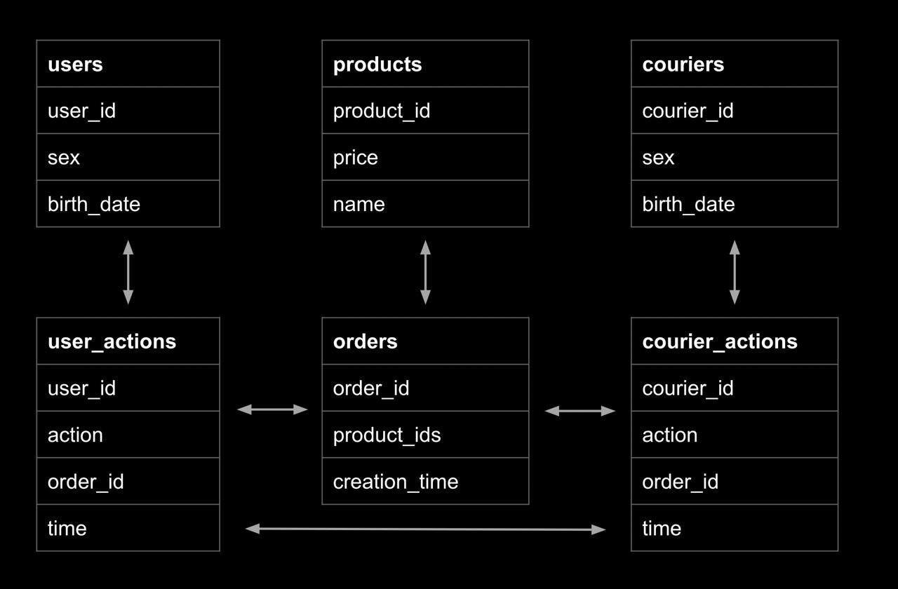

# Курс по SQL

https://lab.karpov.courses/learning/152/module/1762/lesson/18484/53199/251002/

[Login to Redash](https://redash.public.karpov.courses/queries/54778/source)

# Структура базы



# Заметки

```sql
SELECT
  user_id,
  action,
  order_id,
  time
FROM
  user_actions
ORDER BY
  user_id DESC
LIMIT
  10
```

`SELECT` - выбрать колонки

`FROM` - из таблицы

`ORDER` BY - сортировать по

`DESC` - уменьшение

`LIMIT` - ограничение штук

###### 

#### Правильный порядок операторов в запросе выглядит так:

SELECT -- перечисление полей результирующей таблицы
FROM -- указание источника данных
WHERE -- фильтрация данных
GROUP BY -- группировка данных
HAVING -- фильтрация данных после группировки
ORDER BY -- сортировка результирующей таблицы
LIMIT -- ограничение количества выводимых записей

```sql
SELECT
  courier_id,
  action,
  time,
  order_id
FROM
  courier_actions
ORDER BY
  courier_id,
  action,
  time desc
limit
  1000
```

#### Использование псевдонимов:

```sql
SELECT
  name as product_name,
  price as product_price
FROM
  products
ORDER BY
  price desc
limit
  5
```


