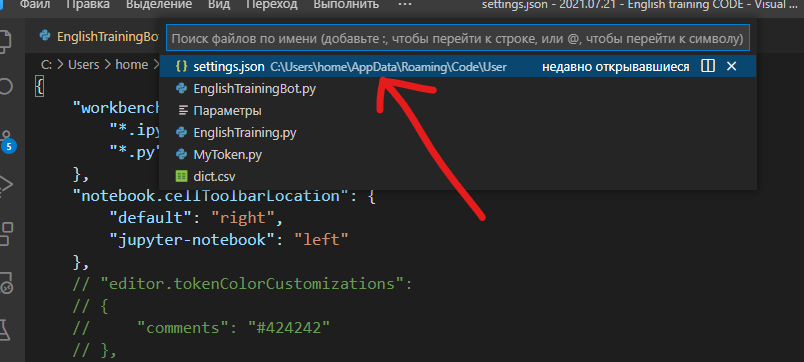
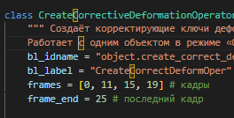
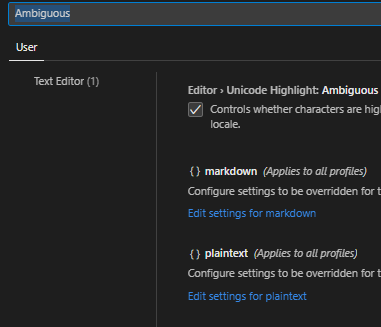

# Вызвать настройки в файле:



**ctrl + P** и далее редактировать файл **settings.json**

**На Мак:** ⇧⌘P

# Открывать на новой вкладке файл

`"workbench.editor.enablePreview": false`

# Убрать подсветку букв в VSCODE



Надо убрать галочку возле: Editor -> Unicode Highlight: Ambiguous Characters



# Цвет коментов

```json
"editor.tokenColorCustomizations":
    {
        "comments": "#424242" // цвет коментов
    }
```
