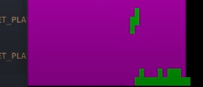
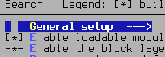
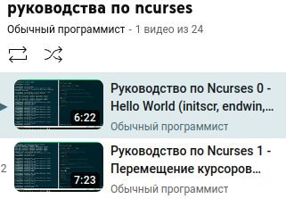

# Ссылки

[Tetris · GitLab](https://repos.21-school.ru/students/C7_BrickGame_v1.0.ID_1449897/gentrifr_student.21_school.ru/C7_BrickGame_v1.0-1)

---

[Tetris с нуля на языке C - YouTube](https://www.youtube.com/watch?v=9FU90CGSZpU)

---

[Библиотека Curses](https://www.ibm.com/docs/ru/aix/7.2?topic=concepts-curses-library)

---

[Новые проклятия: руководство по ncurses &#x2F; Хабр](https://habr.com/ru/articles/778040/)

---

delay - не помню, но это нужно

---

[Ncurses Tutorial 0 - Hello World (initscr, endwin, refresh, getch, printw) - YouTube](https://www.youtube.com/watch?v=lV-OPQhPvSM&list=PL2U2TQ__OrQ8jTf0_noNKtHMuYlyxQl4v&index=1)
