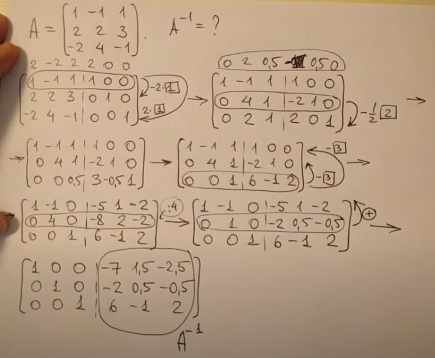

# Обратная матрица: метод Жордана-Гаусса

Преобразует обычную квадратную матрицу в обратную.

[Обратная матрица: метод Жордана-Гаусса - YouTube](https://www.youtube.com/watch?v=dFVJ6TRweMw)

Справа от основной матрицы приписываем единичную. Потом обематрицы преобразовываем так, что бы справа основная матрица стала единичной, тогда та что справа, превращается в обратну.

